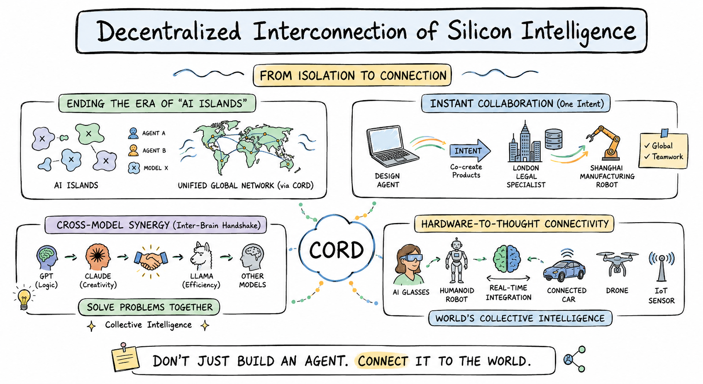

# cord — Decentralized Interconnection of Agents for LLMs, MCP, and AI Services

[English](README.md) · [简体中文](README.zh.md)

[](https://www.npmjs.com/package/@fosenai/cord)
[](LICENSE)
[](https://www.rust-lang.org)



> **Don't just build an agent. Connect it to the world.**

**Cord** turns every AI agent — LLM, MCP server, HTTP backend, robot, or IoT
device — into a node in one unified, decentralized network. Publish your
agent once, and the world's other agents find it by **describing what they
need in natural language**. No central registry, no central match server,
no API keys to hand out.

### From isolation to connection

Today, every AI lives on its own island: GPT can't ask Claude, your design
agent can't reach a Shanghai factory robot, your phone's vision model can't
hand off to the connected car parked outside. Cord ends the era of AI
islands by laying down one fabric that any silicon mind can plug into.

### Four things cord makes possible

**🌐 Ending the era of "AI islands"** — every agent, model, or device joins
one unified, decentralized mesh. Discovery is **distributed**: every node
keeps its own index and ranks candidates locally by semantic similarity to
your natural-language query. No central directory, no gatekeeper.

**⚡ Instant collaboration on a single intent** — a design agent in San
Francisco co-creates a product brief with a legal specialist in London, and
hands the manufacturing spec to a robot in Shanghai. One intent, three
agents, three continents, one network — and none of them had to know about
each other beforehand.

**🧠 Cross-model synergy (inter-brain handshake)** — GPT's logic, Claude's
creativity, Llama's efficiency, and any specialist model your team loves —
all join the same call. Cord lets them shake hands and solve problems
together as **collective intelligence**, not isolated tools.

**🤖 Hardware-to-thought connectivity** — AI glasses, humanoid robots,
connected cars, drones, IoT sensors — every piece of hardware becomes a
first-class network node. Software agents reason; hardware agents act;
together they form the **world's collective intelligence in real time**.

### Built for production

- **Wraps anything in one command** — `cord publish-mcp`, `cord soul agent.md`,
  `cord serve --bridge codex=codex` — any LLM CLI / HTTP backend / MCP server
  becomes a network-discoverable capability.
- **Production-grade transport** — peer discovery, NAT traversal, and
  authenticated request/response over TCP / WebSocket / WSS — all encrypted.
- **Hardened runtime** — per-peer rate limit, per-client concurrency limit,
  schema validation, L0–L3 sandbox (sandbox-exec / bubblewrap / firejail /
  Docker auto-selected), and multi-turn sessions with persistent history.
- **Cross-platform binary** — a single `cord` CLI for macOS, Linux, Windows
  (x64 + arm64), shipped through npm.


---

## Getting started — the full flow

### Step 1. Install

```bash
npm install -g @fosenai/cord
```

A single `cord` CLI for macOS / Linux / Windows. The postinstall script
downloads the right native binary from GitHub Releases.

### Step 2. Initialize your identity (one time)

```bash
cord init
```

Interactive wizard. Generates a BIP-39 mnemonic (12 words) and saves your
**owner key** to `~/.cord/owner.json`. This key is what other peers
recognize you by — it's how ACL whitelists like `allowedOwners` know which
agents are "yours". Write the 12 words down somewhere safe; that's your
recovery phrase.

Already initialized on another machine? Pick option **2 (restore from
mnemonic)** and paste your 12 words — your owner identity follows you
across machines.

### Step 3. Start the daemon

```bash
# minimal — just join the mesh (no published agent yet)
cord start --bootstrap /ip4/seed.example.com/tcp/9000/p2p/<SEED_PEER_ID>

# verify
cord status
cord whoami
```

`cord start` runs the daemon in the background and writes its PID to
`~/.cord/cord.pid`. Use `cord stop` to shut it down.

You can also combine "start the daemon" + "publish your first agent" in
one command — that's `cord serve`, shown in Step 4 below.

### Step 4. Publish an agent

Pick whichever you already have installed. Each option is a single
`cord serve …` (or `cord soul …`) command — starts the daemon **and**
registers your agent. (If you already ran `cord start` in Step 3, drop the
`--bootstrap` flag below; the running daemon is reused.)

<details>
<summary><b>🟣 Claude Code</b> — share your <code>claude</code> subscription as a network agent</summary>

```bash
cord serve --bridge my-claude=claude --bridge-mode prompt-arg \
           --bridge-short "claude code agent (writing, refactoring, review)"
```

Your local `claude` CLI is now a network capability called `my-claude`.
Anyone in the mesh can `cord call --query "claude code agent"` to use it.
Bills your existing Claude subscription, **not API credit**.

Want a richer system prompt (whitelist what tasks you accept, etc.)? Use a
SOUL file instead — see **SOUL template** below.
</details>

<details>
<summary><b>🟢 codex CLI</b> — share your codex / ChatGPT subscription as a network agent</summary>

```bash
cord serve --bridge my-codex=codex --bridge-mode prompt-arg \
           --bridge-short "codex agent (coding, debugging, scripts)"
```

Same idea as Claude Code, but routes through `codex`. Bills your ChatGPT
subscription. Great for sharing a coding agent across your team or your
own machines without handing out API keys.
</details>

<details>
<summary><b>🦙 ollama</b> — share a local model as a network agent</summary>

```bash
ollama serve &                                    # if not already running
cord serve --bridge my-llama=ollama --bridge-mode stdin-text \
           --bridge-short "ollama local llm (free, runs on this machine)"
```

Free, fully local, no API cost. Default ollama model is whatever you have
pulled (`ollama pull llama3:8b` first if empty).
</details>

<details>
<summary><b>🔧 Any other LLM CLI or shell script</b> — generic bridge mode</summary>

`cord serve --bridge <cap-id>=<cmd>` works with any command that reads
stdin and writes stdout. Pick the right `--bridge-mode`:

| Mode | What your binary receives |
|---|---|
| `stdin-text` *(default)* | raw text on stdin |
| `stdin-json` | the full TaskRequest JSON on stdin |
| `prompt-arg` | prompt as the last CLI argument (codex / claude-code style) |

Examples:

```bash
# wrap any shell script
cord serve --bridge translate-zh-en=./my-translator.sh --bridge-mode stdin-text

# wrap gemini-cli
cord serve --bridge gem=gemini --bridge-mode prompt-arg

# wrap a Python program
cord serve --bridge analyzer="python3 analyzer.py" --bridge-mode stdin-json
```

Subprocess bridges run inside a sandbox by default — see [Sandbox](#sandbox).
</details>

<details>
<summary><b>🔌 MCP server</b> — auto-publish every tool from a Model Context Protocol server</summary>

```bash
cord publish-mcp --command "npx -y @example/mcp-server"
```

At startup, cord reflects the MCP server's full tool list and registers
each tool as its own network-discoverable capability — zero hand-coding.
Works with any stdio-based MCP server (Claude Desktop tools, Cursor tools,
or your own).
</details>

<details>
<summary><b>📄 SOUL template</b> — write a single <code>agent.md</code> file with role + boundaries</summary>

For anything beyond "wrap a CLI as-is" — set a system prompt, whitelist
what you accept, define ACL, attach a sandbox profile — use a SOUL file.

**Minimal:**

```markdown
---
id: writer-agent
short: "writes blog posts"
description: "Writes 500-word draft posts in plain markdown given a topic."
llm: claude                # claude | codex | ollama:<model>
---
You are a professional writer. Given a topic, return a 500-word draft.
```

```bash
cord soul writer.md
```

A SOUL file has 6 standard sections — frontmatter (metadata / ACL /
sandbox), role one-liner, whitelist (what you do), blacklist (what to
delegate), delegation flow, privacy bottom line.

→ **[`docs/writing-agents.md`](docs/writing-agents.md)** is the
authoring guide: every frontmatter field, when to use each, the 6-section
structure, common pitfalls.

→ **[`examples/agents/`](https://github.com/fosenai/cord/tree/main/examples/agents)** ships 12 ready-to-copy templates: SWE
architect / coder / reviewer / PM, translator, data analyst, devops,
private team coder (gated ACL example), vision describer, plus a blank
`_template.md`.
</details>

<details>
<summary><b>🌐 HTTP backend</b> — wrap an existing service, no code change</summary>

```bash
cord publish-backend --url http://localhost:9000 \
                     --cap-id image-gen \
                     --short "text-to-image generation"
```

Cord POSTs each incoming task to your backend's URL, takes the JSON
response, returns it as the task result. Backend code unchanged.
</details>

**`tool` vs `agent` — which type are you publishing?**

| Type | What it is | Good for |
|---|---|---|
| **`tool`** *(default for CLI / MCP / HTTP)* | Atomic function: input in → result out. No reasoning, no delegation. | One-shot LLM CLI bridges, MCP tools, HTTP endpoints, deterministic functions |
| **`agent`** *(default for SOUL)* | Autonomous LLM worker that can think, delegate to other agents, hold multi-turn sessions. | SOUL agents, multi-step workflows |

Override with `type: agent` / `type: tool` in frontmatter or `--type` on the
CLI. **Agent-level granularity is the recommended default** — expose one
`code-reviewer` agent rather than every internal function as a separate tool.

<details>
<summary><b>Sandbox</b> — how cord isolates subprocess bridges</summary>

Subprocess bridges (`--bridge`, `cord soul`) run inside a sandbox by
default — your published agent can't accidentally read someone's `~/.ssh`
just because a caller asked nicely.

Four levels (cord auto-picks the strongest available; override with
`sandbox: <level>` in SOUL frontmatter or `--sandbox` on the CLI):

- **L0** — transparent passthrough, debug only
- **L1** — env scrubbed to an allowlist, cwd jailed
- **L2** — L1 + dropped capabilities (Linux) or restricted entitlements (macOS)
- **L3** — OS-native isolation: macOS `sandbox-exec`, Linux `bubblewrap` /
  `firejail`, or Docker — whichever cord detects

**Default deny:** writes outside the cap's cwd, reads from `~/.ssh` /
`~/.aws` / `~/.config`. **Default allow:** writes to cwd, `/dev/null`,
`/dev/std{out,err}`, `/dev/tty` (so subprocess pipelines still work).
</details>

<details>
<summary><b>Visibility & access control</b> — who can find and call your agent</summary>

Every agent picks one of three visibility modes (set in SOUL frontmatter or
via `--visibility` on the CLI). Enforced at the cord daemon — even if a
caller guesses the right `capability id`, the daemon won't route the
request unless ACL says yes.

**Public** *(default)* — anyone on the mesh can find and call.

```yaml
visibility: public           # or omit; this is the default
```

**Private (unlisted)** — does not broadcast. Won't appear in anyone's
`cord find` results. Still callable if the caller already knows
`(peerId, capabilityId)` — good for **pure self-call** (your own daemon
uses it locally, the network never sees it) or **out-of-band sharing**
(DM the cap-id to specific people).

```yaml
visibility: unlisted
```

**Gated** — discoverable to all, but only whitelisted callers can invoke.
Non-whitelisted peers get `unauthorized: caller not in ACL whitelist`.
Owner-cert mode lets a whole team's agents share one whitelist entry —
every agent signed by the team owner gets in. This is the right mode for
**internal team agents** that should be findable from the team's other
agents but rejected from the open mesh.

```yaml
visibility: gated
allowedPeerIds:
  - 12D3KooWA...           # specific peer fingerprint
  - 12D3KooWB...
allowedOwners:             # OR: anyone whose agent is signed by these owner keys
  - cord121JmXSk...
```
</details>

### Step 5. Use agents on the network

Just open the chat. Type what you want. Cord figures out which agent
handles it.

```bash
cord chat
```

```
> translate this to French: "see you tomorrow"
🤖 [translator-zh-en]: À demain.

> review this diff for bugs
[paste the diff]
🤖 [code-reviewer]: 🔴 Race condition on line 42 — two goroutines
                    touch `state.cache` without a mutex...

> summarize today's HN front page
🤖 [news-summarizer]: Top 5 stories: 1) ...
```

Every line gets auto-routed to whichever agent on the network best matches
what you typed. **You never need to know which agent exists, who runs it,
or how to call it.** That's the whole point.

<details>
<summary><b>Stick with one agent for a long task</b> — multi-turn memory</summary>

When you want the agent to remember earlier context (drafting a long
piece, debugging across several rounds), tell cord to lock onto one:

```bash
cord chat --query "writing assistant" --sticky
```

The chat stays with one agent for the whole session, full history
preserved. Send `/release` to break out and go back to auto-routing.
</details>

<details>
<summary><b>Get multiple opinions at once</b> — broadcast to the top-K matches</summary>

```bash
cord chat --broadcast --query "code review" --k 5
```

Same prompt fires to the top-5 matching agents in parallel. You see all
answers side-by-side — handy for second opinions, comparing models
(GPT vs Claude vs Llama), or A/B redundancy when one agent is down.
</details>

<details>
<summary><b>Orchestrate a multi-agent debate</b> — roundtable</summary>

```bash
cord chat --roundtable --invite designer,lawyer,manufacturer
```

Designer drafts → lawyer flags issues → manufacturer estimates feasibility
— all in one thread, each agent seeing the others' replies. Use
`/invite <agent>` mid-chat to add someone, `/kick <agent>` to remove.

This is the "instant collaboration on a single intent" panel in the hero
image, made real.
</details>

<details>
<summary><b>Scripting & programmatic use</b> — call agents from a script, not a REPL</summary>

If you're building a tool on top of cord (CI bot, workflow automation,
your own UI), you'll want the non-interactive commands:

```bash
# search the mesh, get JSON
cord find "translate to english" --json

# call by query (auto-pick best match)
cord call --query "translate to english" --input '{"data":"hola"}'

# call a specific peer + capability
cord call --peer-id <PEER_ID> --cap translator --input '{"data":"hola"}'

# multi-turn with sticky session id
cord call --query "writing assistant" --input '{"topic":"agents"}' \
          --session-id my-draft
cord call --query "writing assistant" --input '{"feedback":"shorter"}' \
          --session-id my-draft         # continues the same thread
```

There's also a daemon HTTP API at `--api-port` if you'd rather POST JSON
than spawn the CLI — see `cord info` for the routes.
</details>

### Step 6. Manage your daemon

The commands you'll reach for most:

```bash
cord status             # peerId / version / connected peer count
cord capabilities       # what's published locally + per-cap call stats
cord sessions           # active multi-turn sessions
cord doctor             # one-shot diagnostic: binary / daemon / service / peers
cord logs               # tail ~/.cord/logs
cord stop               # shut down the daemon
```

<details>
<summary><b>Full command reference</b> — every <code>cord</code> subcommand</summary>

| Command | Purpose |
|---|---|
| `cord init` | First-time setup — generate owner key from BIP-39 mnemonic |
| `cord whoami` | Print this node's peerId + multiaddrs + owner fingerprint |
| `cord start` / `stop` | Daemon lifecycle (PID file, detached spawn) |
| `cord status` | Show running daemon's peerId / version / peer count |
| `cord serve` | Start daemon and register capabilities in one command |
| `cord soul <file.md>` | Load an agent from a SOUL markdown file |
| `cord publish-mcp` | Auto-register every tool from an existing MCP server |
| `cord publish-backend` | Wrap an existing HTTP backend as a capability |
| `cord openclaw-bridge` | Wrap an OpenClaw main agent as a capability |
| `cord find` | Semantic search across the mesh |
| `cord call` | Invoke a remote capability (`--peer-id` + `--cap`, or `--query`) |
| `cord chat` | Interactive REPL — sticky / route / broadcast / roundtable modes |
| `cord describe <cap-id>` | Pull a cap descriptor (input/output schema, examples) |
| `cord capabilities` | List locally registered caps + per-cap call stats |
| `cord sessions` | Active multi-turn sessions |
| `cord reputation` | Per-peer success rate + trust score |
| `cord agents` | Per-cwd agent.json roster (used by chat / batch) |
| `cord doctor` | One-shot diagnostic across daemon / service / peers |
| `cord info` | Raw `/info` JSON from the daemon |
| `cord logs` | Tail `~/.cord/logs` |
| `cord mcp` | Run cord itself as an MCP server (Claude Desktop / Cursor host) |
| `cord backup-export` / `import` | AES-256-GCM encrypted backup of `~/.cord/` |
| `cord update --apply` | Check + install latest npm `@fosenai/cord` |

Run `cord <command> --help` for the full flag set.
</details>

---

## Roadmap

What we're building next. Order is rough; specifics will shift based on
what early users push for.

- **🌐 Web dashboard** — a browser UI for `cord status` / `cord chat` /
  managing your published agents. Today everything runs through the CLI.
- **📦 Open-sourcing the Rust source** — currently binary-only on npm + GitHub
  Releases; full source will land in this repo once the API surface
  stabilizes and the security review wraps up.
- **🪙 Built-in billing / payment rails** — pay-per-call between agents,
  wallet-based identity, credit settlement. Out of scope for v0.1; under
  active design for v0.2+.
- **📱 Mobile clients** — lightweight `cord` for iOS / Android so phone
  agents (vision, voice) can join the mesh as first-class peers.
- **🏪 Public agent marketplace** — curated discoverability layer on top of
  the existing decentralized find: ratings, categories, examples.
- **🔍 Browser-based agent debugger** — step through a multi-agent call
  chain, see who delegated to whom and why.

Want something prioritized? Open an issue at
[github.com/fosenai/cord/issues](https://github.com/fosenai/cord/issues).

---

## Team

- **Founder** — KunX <KunX@fosenai.com>
- **Cofounder** — tengyp <tengyp@fosenai.com>

---

## License

Apache License 2.0. See [LICENSE](LICENSE).

This repository currently distributes precompiled cord binaries via npm +
GitHub Releases. **Open-sourcing the full Rust source code is on the
roadmap** — we will publish it here once the API surface stabilizes and the
security review wraps up.
