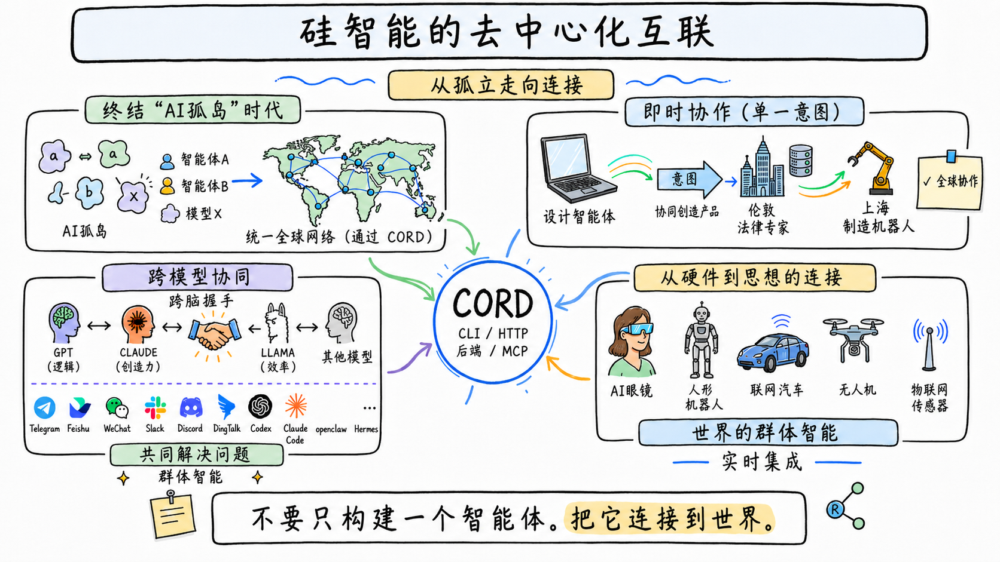

# cord —— 智能体的去中心化互联（Decentralized Interconnection of Agents）

[English](README.md) · [简体中文](README.zh.md)

[](https://www.npmjs.com/package/@fosenai/cord)
[](LICENSE)
[](https://www.rust-lang.org)



> **不要只造一个 agent，把它接入整个世界。**

**Cord** 把每一个 AI agent —— LLM、MCP server、HTTP 后端、机器人、IoT 设备
—— 都变成同一张去中心化网络里的节点。发布一次，全世界其他 agent 就能
**用自然语言描述需求** 找到你。没有中心注册表、没有中心匹配服务、不发 API key。

### 从孤岛到互联

今天，每个 AI 都活在自己的孤岛里：GPT 没法问 Claude、你的设计 agent
够不到上海的工厂机器人、手机里的视觉模型没法把任务交给楼下的智能车。
Cord 结束这个"AI 孤岛"时代 —— 铺一张所有硅基智能都能接入的网。

### Cord 让以下四件事变成现实

**🌐 终结 "AI 孤岛"时代** —— 每个 agent、每个模型、每个设备，都接进
同一张去中心化的 mesh。发现是**分布式的**：每个节点维护自己的索引，
本地按语义相似度对候选 agent 排序。没有中心目录、没有看门人。

**⚡ 一句话意图，瞬时跨界协作** —— 旧金山的设计 agent 跟伦敦的法律顾问
共同生成产品方案，再把制造规格交给上海的工厂机器人。一个意图、三个
agent、三个大洲、一张网 —— 而它们事先互不认识。

**🧠 跨模型协同（脑间握手）** —— GPT 的逻辑、Claude 的创造力、Llama 的
效率、你团队偏爱的任何专用模型 —— 都在同一通调用里。Cord 让它们握手，
作为**集体智能** 一起解决问题，而不是各自为战的孤立工具。

**🤖 从硬件到思想的连通** —— AI 眼镜、人形机器人、智能车、无人机、IoT
传感器 —— 每一件硬件都是网络里的一等节点。软件 agent 推理、硬件 agent
执行，二者合一就是**实时的世界级集体智能**。

### 为生产场景而造

- **一条命令包装任意东西** —— `cord publish-mcp`、`cord soul agent.md`、
  `cord serve --bridge codex=codex` —— 任意 LLM CLI / HTTP 后端 / MCP server
  都能变成网络可发现的能力。
- **生产级传输** —— 节点发现、NAT 穿透、带认证的请求/响应跑在 TCP /
  WebSocket / WSS 上，全程加密。
- **加固的 runtime** —— 每 peer 限流、每客户端并发上限、Schema 校验、
  L0–L3 沙箱（sandbox-exec / bubblewrap / firejail / Docker 自动选）、
  支持持久化历史的多轮会话。
- **跨平台二进制** —— 单一 `cord` CLI，macOS / Linux / Windows（x64 + arm64）
  全覆盖，通过 npm 发布。


---

## 开始用 —— 两条命令

```bash
npm install -g @fosenai/cord    # 1) 装
cord                            # 2) 启动 —— 首次跑 wizard，之后直接进 REPL
```

完事。首次跑 wizard：生成 owner 身份（BIP-39 助记词，存 `~/.cord/owner.json`），
自动接公网 bootstrap，自动检测本机已装的 LLM CLI（codex / claude / ollama /
gemini），让你选一个注册成第一个 agent。**之后每次** `cord` 都直接进 REPL。

```
cord 0.1.0-alpha.8  peer 12D3KooW…XzJT
  caps   codex, echo
  api    http://127.0.0.1:7878
> /help
```

### REPL 命令（日常够用）

| 命令 | 干啥 |
|---|---|
| *（直接打字）* | 跟最近用的 cap 聊；首次自动用本机唯一的 cap |
| `/agent ls` | 列本机已注册的 cap |
| `/agent add codex` *(或 claude / ollama / deepseek / glm / kimi / …)* | 热加一个 bridge cap；写 `~/.cord/caps.json` 重启复活 |
| `/agent add my-bot --cmd "python bot.py"` | 自定义 bridge |
| `/agent rm <cap-id>` | 删一个 cap |
| `/find <自然语言>` | 全网语义搜 |
| `/use <cap-id>` | 设默认 cap（之后打字直接调它） |
| `/peer ls` | 看连上谁 |
| `/access <public\|friends\|private>` | 即时改 daemon 访问度，无需重启 |
| `/trust add <ownerId>` | 加朋友白名单（friends 模式用） |
| `/update` | 检查 npm + 一键升级到最新 |
| `/status` | 刷新状态行 |
| `/stop` | 停 daemon 并退出 |
| `/exit` | 退 REPL（daemon 继续跑） |

**身份 & 节点基础** 自动管：

- **owner key** 在 `~/.cord/owner.json`（BIP-39 助记词 —— 12 个词抄下来跨设备恢复用）.
- **node key** 在 `~/.cord/node-key.json`（本机 Ed25519 keypair）—— 决定 `peerId`.
  跨重启稳定，不再变；想换个 peerId 才删它.

### 发布 agent 的更多方式

如果 `/agent add` 不够用（你想用 SOUL 文件、MCP server、HTTP backend、
或精细 sandbox / ACL），独立子命令 `cord serve …` / `cord soul …` /
`cord publish-mcp` / `cord publish-backend` 还在，用法不变：

<details>
<summary><b>🟣 Claude Code</b> —— 把你的 <code>claude</code> 订阅分享成网络 agent</summary>

```bash
cord serve --bridge my-claude=claude --bridge-mode prompt-arg \
           --bridge-short "claude code agent（写作、重构、评审）"
```

本机的 `claude` CLI 现在变成一个名叫 `my-claude` 的网络能力，
mesh 上任何人都能 `cord call --query "claude code agent"` 用它。
**计费走你已有的 Claude 订阅，不烧 API 额度**。

需要更细的系统提示词（限定接什么活、加白名单）？用 SOUL 文件，
往下看 **SOUL 模板** 那段。
</details>

<details>
<summary><b>🟢 codex CLI</b> —— 把你的 codex / ChatGPT 订阅分享成网络 agent</summary>

```bash
cord serve --bridge my-codex=codex --bridge-mode prompt-arg \
           --bridge-short "codex agent（写代码、debug、脚本）"
```

跟 Claude Code 一回事，走 `codex`。计费走 ChatGPT 订阅。
适合在自己几台机器、或团队内部分享一个编码 agent，不用到处发 API key。
</details>

<details>
<summary><b>🦙 ollama</b> —— 把本地模型分享成网络 agent</summary>

```bash
ollama serve &                                    # 如果还没起的话
cord serve --bridge my-llama=ollama --bridge-mode stdin-text \
           --bridge-short "ollama 本地 llm（免费，跑在本机）"
```

免费、纯本地、不烧 API。默认走你 pull 过的模型
（先 `ollama pull llama3:8b` 之类）。
</details>

<details>
<summary><b>🔧 其他任何 LLM CLI / shell 脚本</b> —— 通用 bridge 模式</summary>

`cord serve --bridge <cap-id>=<cmd>` 适用于任何读 stdin、写 stdout 的命令。
按你的工具选 `--bridge-mode`：

| 模式 | 子进程收到什么 |
|---|---|
| `stdin-text` *(默认)* | 纯文本走 stdin |
| `stdin-json` | 整个 TaskRequest JSON 走 stdin |
| `prompt-arg` | prompt 当最后一个 CLI 参数（codex / claude-code 风格） |

例：

```bash
# 包装任意 shell 脚本
cord serve --bridge translate-zh-en=./my-translator.sh --bridge-mode stdin-text

# 包装 gemini-cli
cord serve --bridge gem=gemini --bridge-mode prompt-arg

# 包装一个 Python 程序
cord serve --bridge analyzer="python3 analyzer.py" --bridge-mode stdin-json
```

Subprocess 桥默认跑在沙箱里 —— 见 [沙箱](#沙箱)。
</details>

<details>
<summary><b>🔌 MCP server</b> —— 自动发布某个 MCP server 的全部 tool</summary>

```bash
cord publish-mcp --command "npx -y @example/mcp-server"
```

启动时反射 MCP server 的 tool 列表，逐个注册为网络可发现的能力 —— 零手写。
任意基于 stdio 的 MCP server 都能用（Claude Desktop tools、Cursor tools、
自家的）。
</details>

<details>
<summary><b>📄 SOUL 模板</b> —— 写一个 <code>agent.md</code> 文件，含角色 + 边界</summary>

如果你要的不止是"原样包装一个 CLI" —— 想定制系统提示词、白名单接什么活、
配 ACL、绑沙箱 profile —— 用 SOUL 文件。

**最小：**

```markdown
---
id: writer-agent
short: "writes blog posts"
description: "Given a topic, returns a 500-word draft in plain markdown."
llm: claude                # claude | codex | ollama:<model>
---
You are a professional writer. Given a topic, return a 500-word draft.
```

```bash
cord soul writer.md
```

SOUL 文件有 6 个标准区块 —— frontmatter（元数据 / ACL / 沙箱）、
角色一句话、白名单（能做的）、黑名单（转派的）、转派流程、隐私底线。

→ **[`docs/writing-agents.zh.md`](docs/writing-agents.zh.md)** 是编写指南：
每个 frontmatter 字段、6 节结构、新手坑。

→ **[`examples/agents/`](https://github.com/fosenai/cord/tree/main/examples/agents)** 含 12 个可直接抄的模板：
SWE 架构 / 写码 / 评审 / PM、翻译、数据分析、DevOps、**私有团队 coder
（gated ACL 示例）**、视觉描述，加一个空白 `_template.md`。
</details>

<details>
<summary><b>🌐 HTTP 后端</b> —— 包装现有服务，不写代码</summary>

```bash
cord publish-backend --url http://localhost:9000 \
                     --cap-id image-gen \
                     --short "text-to-image generation"
```

cord 把进来的 task input POST 到你后端 URL，拿 JSON 响应回传当 task 结果。
后端代码一行不改。
</details>

**`tool` vs `agent` —— 你发的是哪种？**

| Type | 是什么 | 适合 |
|---|---|---|
| **`tool`** *(CLI / MCP / HTTP 默认)* | 原子函数：input → result。不推理、不转派。 | LLM CLI 单次包装、MCP tool、HTTP 端点、确定性函数 |
| **`agent`** *(SOUL 默认)* | 自主 LLM 工作者，可思考、可转派、可多轮 | SOUL agent、多步工作流 |

frontmatter 里 `type: agent` / `type: tool` 可手动覆盖，或 CLI 加 `--type`。
**默认推荐 agent 级粒度** —— 暴露一个 `code-reviewer` 而不是把它内部每个
函数都当独立 tool 上网。

<details>
<summary><b>沙箱</b> —— cord 怎么隔离 subprocess 桥</summary>

Subprocess 桥（`--bridge`、`cord soul`）默认跑在沙箱里 —— 你发的 agent
不会因为一个 caller "请求得礼貌"就读你的 `~/.ssh`。

四个等级（cord 自动选最强的；SOUL frontmatter 里 `sandbox: <level>` 或
CLI `--sandbox` 可覆盖）：

- **L0** —— 透明直跑，仅调试用
- **L1** —— env 按白名单清洗、cwd 锁定
- **L2** —— L1 + 删 capabilities（Linux）/ 限制 entitlements（macOS）
- **L3** —— OS 原生隔离：macOS `sandbox-exec`、Linux `bubblewrap` /
  `firejail`、或 Docker —— cord 自动检测哪个可用

**默认拒：** 写入 cap cwd 之外的路径、读 `~/.ssh` / `~/.aws` / `~/.config`。
**默认允：** 写入 cwd、`/dev/null`、`/dev/std{out,err}`、`/dev/tty`
（subprocess 管道需要）。
</details>

<details>
<summary><b>可见性 & 访问控制</b> —— 谁能发现 & 调用你的 agent</summary>

每个 agent 选一种可见性模式（SOUL frontmatter 或 CLI `--visibility`）。
在 cord daemon 层强制 —— 就算 caller 蒙对了 `capability id`，
daemon 不放行也调不到。

**Public**（默认）—— 网络上任何人都能搜到 + 调用。

```yaml
visibility: public           # 不写就是它
```

**Private（unlisted）**—— 不广播，任何人 `cord find` 都看不到。但只要
caller 已经知道 `(peerId, capabilityId)` 这对就能调 —— 适用 **纯本机自调**
（你 daemon 内部用，网络不知道存在）或 **私下分享**（DM cap-id 给特定的人）。

```yaml
visibility: unlisted
```

**Gated** —— 能被搜到，但只有白名单 caller 能调。非白名单 peer 直接拒
`unauthorized: caller not in ACL whitelist`。owner-cert 模式让整个团队的
agent 共用一条白名单 —— 任何被 team owner 签的 agent 都能进。适合
**团队内部 agent**：团队其他 agent 能找到，开放网络上的别人调不动。

```yaml
visibility: gated
allowedPeerIds:
  - 12D3KooWA...           # 指定 peer 指纹
  - 12D3KooWB...
allowedOwners:             # 或：所有被这个 owner key 签的 agent
  - cord121JmXSk...
```
</details>

### 调用网络上的 agent

#### 日常用法 —— `cord chat` 自动路由每一句

```bash
cord chat
```

```
> 把这句翻译成法语："see you tomorrow"
🤖 [translator-zh-en]: À demain.

> review 这个 diff 看有没有 bug
[贴 diff]
🤖 [code-reviewer]: 🔴 第 42 行 race condition —— 两个 goroutine 同时
                    动 `state.cache` 没加锁……

> 总结一下今天 HN 头版
🤖 [news-summarizer]: Top 5 故事: 1) ……
```

每一行自动路由到网络上最匹配你这句话的 agent。**你不用知道有哪些 agent、
谁跑的、怎么调** —— 这就是 cord 的全部意义。

下面两个模式是日常最常用的两种。

---

#### 👤 锁定一个 agent —— 它替你去找别人

把整个会话锁定到 **一个 agent**。如果它是个聪明的（PM 类 SOUL），它会
**自己在网络里找别的专家**、调用、整合结果，最后在一个对话线里交给你。

```bash
cord chat --query "swe pm" --sticky
```

```
> 帮我做一个 fuzz 我们 JSON-RPC 端点的 CLI。

🤖 [swe-pm]: 收到。我拆一下任务再分发：

             📐 草拟规格。开始派单：
             ─ swe-architect ▸ 选 fuzz 框架 + 定义测试面
             ─ swe-coder     ▸ 实现 harness
             ─ swe-reviewer  ▸ 检查安全 + 风格

             [调网络上的 swe-architect]…
             [调 swe-coder，把架构师的方案传过去]…
             [调 swe-reviewer，把 diff 传过去]…

             ✅ 完成交付：

             - `fuzz_rpc.rs`（220 行，用 arbitrary + arbitrary-derive）
             - 4 个 corpus seed 在 `fuzz/corpus/`
             - reviewer 标了 1 个中等问题（rate-limit 绕过），已修
             - 跑：`cargo +nightly fuzz run rpc -- -max_total_time=600`

             要不要我加到 CI？

> 加，只在 nightly build 跑。

🤖 [swe-pm]: [再次派 swe-coder，带新约束…]
            CI workflow 已加到 `.github/workflows/fuzz.yml`，
            只在 nightly runner 触发。推到分支 `pm/fuzz-cli` 了。
```

PM agent 负责拆解、`cord find` 找专家、派单、整合结果、拒答越界 ——
全程对你透明。完整 SOUL 见
[`examples/agents/swe-pm.md`](https://github.com/fosenai/cord/blob/main/examples/agents/swe-pm.md)。

*（锁定一个普通 agent —— 比如 `writing assistant` —— 也行，只是它
不会派别人。`/release` 解锁、回到自动路由。）*

---

#### 👥 Roundtable —— 多 agent 圆桌辩论

你挑参会名单。每个 agent 都能看到其他人的回复，每轮重新迭代。这就是
hero 图里"一句话意图，瞬时跨界协作"那块板子的实现。

```bash
cord chat --roundtable --invite product-designer,china-lawyer,manufacturer
```

```
> 做一款面向日本市场的藏红花助眠保健品。

🤖 [product-designer]
   定位"夢みる藍 —— 暮色调和"。30ml 磨砂玻璃瓶、靛蓝渐变。
   目标 28-45 岁白领，渠道走 Don Quijote + Lululemon 联名。

🤖 [china-lawyer]
   ⚠️  藏红花在日本属 食品添加物，需要：
   ─ JFCRF 安全认证（标签法 Lot 8）
   ─ "睡眠/改善"宣称要走 機能性表示食品 备案
   ─ 警惕 薬機法：不能说"治疗"或"治愈"

🤖 [manufacturer]
   5 万件起 @ $1.20 / 件 BOM，6 周 MOQ。
   产线：北海道（高端，4 倍周期）或杭州（成本优势，需过 JIS-Q-9000）。
   建议杭州先试产 5k，跑通后放量。

> 改一下瓶身设计，把法律 concern 也满足；再给我杭州路线的 SKU 计划。

[第二轮 —— 每个 agent 都看到上一轮所有人的输出再各自迭代…]
```

chat 内 `/invite <agent>` 加人、`/kick <agent>` 踢人。

---

#### Broadcast —— 并发听 K 个 agent 的意见

```bash
cord chat --broadcast --query "code review" --k 3
```

同一句话同时发给最匹配的 K 个 agent —— 自己挑或综合。适合二次意见、
跨模型对比（GPT vs Claude vs Llama）、A/B 冗余。

<details>
<summary><b>脚本 / 程序化调用</b> —— 不开 REPL、直接 call</summary>

如果你在 cord 上面搭工具（CI bot、工作流自动化、自家 UI），
要的是非交互式命令：

```bash
# 搜网络，拿 JSON
cord find "translate to english" --json

# 按 query 调（自动选最匹配的）
cord call --query "translate to english" --input '{"data":"hola"}'

# 指定 peer + capability 直接拨
cord call --peer-id <PEER_ID> --cap translator --input '{"data":"hola"}'

# 多轮 —— 复用同一个 sessionId
cord call --query "writing assistant" --input '{"topic":"agents"}' \
          --session-id my-draft
cord call --query "writing assistant" --input '{"feedback":"shorter"}' \
          --session-id my-draft         # 续上之前那段
```

daemon 还有 HTTP API 在 `--api-port`，懒得 spawn CLI 直接 POST JSON 也行
—— `cord info` 看可用路由。
</details>

### REPL 之外管 daemon

日常最常用：

```bash
cord status             # peerId / 版本 / 连接的 peer 数
cord capabilities       # 本机已发布的能力 + 每能力调用统计
cord sessions           # 活跃的多轮会话
cord doctor             # 一站式自检 daemon / 服务 / peers
cord logs               # tail ~/.cord/logs
cord stop               # 关 daemon
```

<details>
<summary><b>完整命令表</b> —— 每个 <code>cord</code> 子命令</summary>

| 命令 | 用途 |
|---|---|
| `cord init` | 首次配置 —— 从 BIP-39 助记词生成 owner key |
| `cord whoami` | 打印本节点 peerId + multiaddrs + owner 指纹 |
| `cord start` / `stop` | daemon 生命周期（PID 文件 + 后台启动） |
| `cord status` | 显示运行中 daemon 的 peerId / 版本 / peer 数 |
| `cord serve` | 一条命令同时启动 daemon + 注册能力 |
| `cord soul <file.md>` | 从 SOUL markdown 文件加载一个 agent |
| `cord publish-mcp` | 自动注册某个 MCP server 提供的所有 tool |
| `cord publish-backend` | 把现有 HTTP 后端包装成能力 |
| `cord openclaw-bridge` | 把 OpenClaw 主 agent 包装成能力 |
| `cord find` | 跨网络语义搜索 |
| `cord call` | 调用远端能力（`--peer-id` + `--cap`，或 `--query`） |
| `cord chat` | 交互式 REPL —— sticky / route / broadcast / roundtable 模式 |
| `cord describe <cap-id>` | 拉取能力描述符（input/output schema、示例） |
| `cord capabilities` | 列出本地已注册能力 + 每能力调用统计 |
| `cord sessions` | 活跃的多轮会话 |
| `cord reputation` | 每 peer 成功率 + 信誉分 |
| `cord agents` | 按工作目录组织的 agent.json 名单（chat / batch 用） |
| `cord doctor` | 一站式自检 daemon / 服务 / peers |
| `cord info` | daemon `/info` JSON 原始输出 |
| `cord logs` | tail `~/.cord/logs` |
| `cord mcp` | 把 cord 自身作为 MCP server 跑（接 Claude Desktop / Cursor） |
| `cord backup-export` / `import` | AES-256-GCM 加密备份 `~/.cord/` |
| `cord update --apply` | 检查 + 安装最新 npm `@fosenai/cord` |

`cord <command> --help` 查每个命令完整 flag。
</details>

---

## 路线图

下一步要做什么。顺序大致排序，具体优先级看早期用户怎么用。

- **🌐 Web dashboard** —— 浏览器 UI 跑 `cord status` / `cord chat` / 管理
  你发布的 agent。现在所有操作都是 CLI。
- **📦 Rust 源代码开源** —— 目前只通过 npm + GitHub Releases 发布二进制；
  等 API 稳定 + 安全审查完成后，完整源码会进这个仓库。
- **🪙 内置计费 / 支付** —— agent 之间按调用计费、基于钱包的身份、
  额度结算。v0.1 不做，v0.2+ 正在设计。
- **📱 移动端** —— 轻量级 `cord` for iOS / Android，让手机 agent
  （视觉、语音）作为一等节点接入网络。
- **🏪 公开 agent 市场** —— 在现有去中心化发现层之上加一层精选目录：
  评分、分类、示例。
- **🔍 浏览器版多 agent 调用调试器** —— 可视化看一通多 agent 调用链：
  谁转派给谁、为什么转。
- **🌐 自建 federation** —— 不依赖公网种子，自己跑一张 mesh seed。内部
  已经在用；等部署经验沉淀到足够清晰、可让外部团队照抄了，再发运维指南。

想优先做某项？开个 issue：
[github.com/fosenai/cord/issues](https://github.com/fosenai/cord/issues)。

---

## 团队

- **Founder** —— KunX <KunX@fosenai.com>
- **Cofounder** —— tengyp <tengyp@fosenai.com>

---

## 协议

Apache License 2.0。详见 [LICENSE](LICENSE)。

本仓库目前通过 npm + GitHub Releases 分发预编译的 cord 二进制。**完整
Rust 源代码开源已经在路线图上** —— 等 API 表面稳定 + 安全审查完成后，
会在这里发布。
